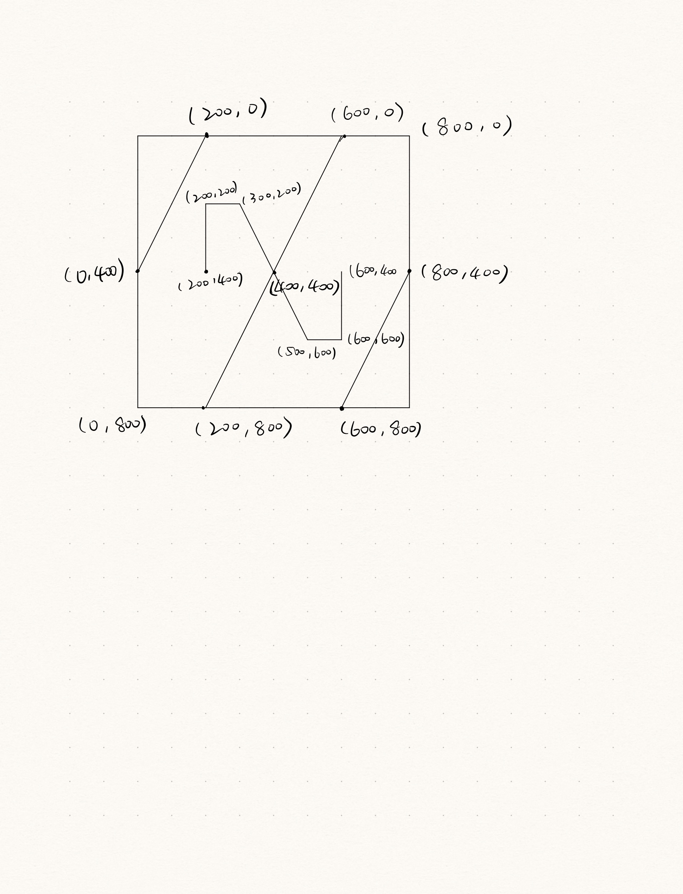

# p5.js Template

This is a README file that can be used to describe and document your assignment.

Markdown Cheatsheet (from [https://www.markdownguide.org/cheat-sheet/](https://www.markdownguide.org/cheat-sheet/)):

---
---

# Heading1
## Heading2
### Heading3
#### Heading4
##### Heading5
###### Heading6

**bold text**

*italicized text*

~~strikethrough text~~

Ordered List:
1. First item
2. Second item
3. Third item

Unordered List:
- First item
- Second item
- Third item

`short code block`

```
extended code block
fun() {
  return 0
}
```

Link:  
[linked text](https://www.example.com)


Image with url:  


Image on repo:  



To start a new line, add two spaces at the end of a line, like this:  
this is a new line.


To start a new paragraph, leave an empty line between two lines of text.

This is a new paragraph.

1.Create a beige-colored canvas  
2.Draw the triangle on the top-leaft corner  
3.Draw the quad on tthe bottom-leat corner  
4.Draw the small quad above it on the left  
5.Draw the small quad next to it on the right side  
6.Draw the triangle on the bottom-right corner  
7.Draw the quad on the top-right corner
